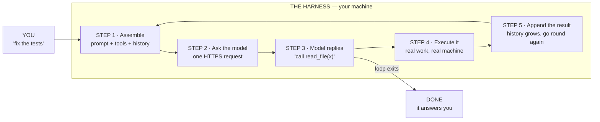
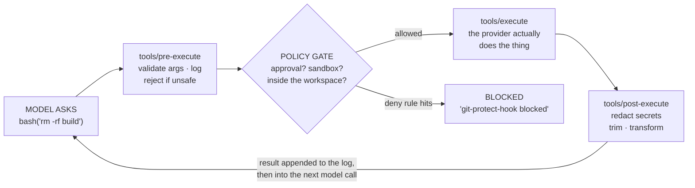
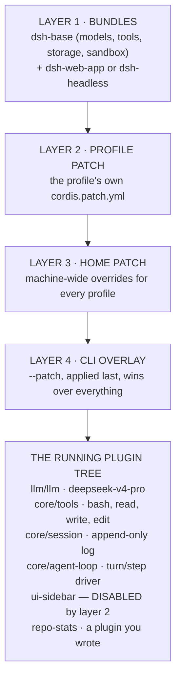
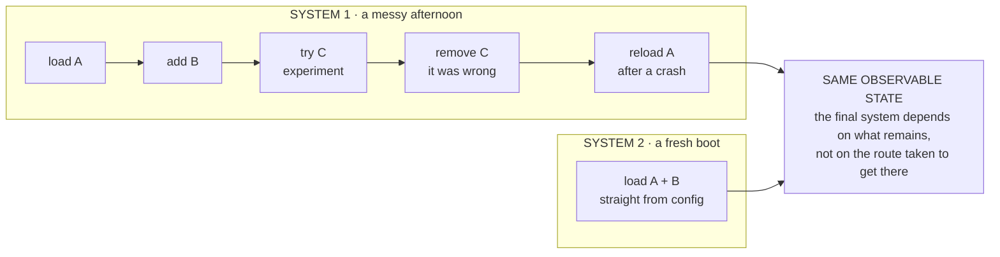
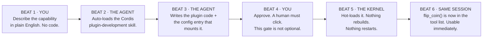
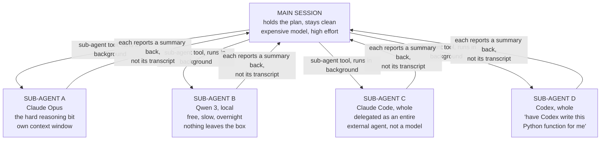
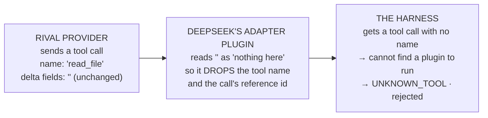
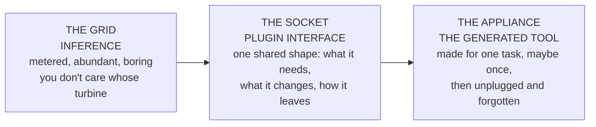

# The Harness Layer

**A step-by-step explanation of what an agent harness actually does, and what DeepSeek changed when it open-sourced its own on 13 August 2026.**

> Short version: the model is a brain in a jar. The harness is the body. DeepSeek gave away the body.

| | |
|---|---|
| **Released** | 13 August 2026 |
| **Licence** | MIT |
| **GitHub stars** | ~188,000 |
| **Forks** | ~20,900 |
| **Status** | Developer preview |
| **Kernel** | Cordis |

*Compiled 23 August 2026 from 11 video teardowns plus 8 primary sources. Colour key used in the diagrams: the **harness** is machinery you own; the **model** is intelligence you rent.*

---

## Contents

- [00 — The 60-second answer](#00--the-60-second-answer)
- [01 — What a harness is](#01--what-a-harness-is-in-the-plainest-possible-terms)
- [02 — Harness processing: the loop](#02--harness-processing-is-a-loop-here-is-the-loop)
- [03 — Inside one model call](#03--what-is-actually-inside-one-model-call)
- [04 — Turns, steps and the append-only log](#04--turns-steps-and-the-append-only-log)
- [05 — The tool pipeline](#05--step-4-in-detail-the-tool-pipeline)
- [06 — Code versus configuration](#06--the-one-real-difference-code-versus-configuration)
- [07 — Everything is a plugin](#07--everything-is-a-plugin--and-they-do-mean-everything)
- [08 — How a running harness is assembled](#08--how-a-running-harness-is-assembled-at-boot)
- [09 — Cordis, part one: time](#09--cordis-part-one-making-removal-safe)
- [10 — Cordis, part two: space](#10--cordis-part-two-making-dependencies-safe)
- [11 — Confluence](#11--confluence-why-the-detours-dont-accumulate)
- [12 — The four modes](#12--getting-it-running-and-the-four-modes)
- [13 — Creator mode, step by step](#13--creator-mode-watching-an-agent-extend-itself-step-by-step)
- [14 — The trajectory view](#14--the-trajectory-view-nothing-is-hidden)
- [15 — Sub-agents and any model](#15--sub-agents-and-running-four-companies-models-at-once)
- [16 — Permissions vs sandbox](#16--permissions-and-sandboxing-are-two-different-dials)
- [17 — Where it breaks](#17--where-it-breaks--and-it-does-break)
- [18 — Why give it away?](#18--why-would-anyone-give-away-the-thing-everyone-else-sells)
- [19 — Does it actually work?](#19--does-it-actually-build-anything-one-head-to-head-test)
- [20 — The bigger idea](#20--what-everything-is-a-plugin-is-actually-reaching-for)
- [Glossary](#glossary)
- [Sources](#sources)

---

## 00 — The 60-second answer

Every video in this set is circling one idea, so let's put it down plainly before anything else.

An AI model, by itself, does exactly one thing: **it turns text into more text.** That's the whole job. It cannot open a file on your laptop. It cannot run a command. It cannot check whether the code it just wrote actually works. It produces words and then it stops.

A **harness** is the ordinary program that sits between that text generator and your actual computer. It reads the model's words, does the real work those words describe, catches the result, and hands the result back to the model so it can decide what to do next. Then it does it again. And again. Until the job is finished.

**"Harness processing"** — the phrase in these videos — is simply *everything that happens on your machine between one model call and the next*. Assembling the prompt. Deciding which tools the model may use. Running the tool it picked. Catching the error. Writing it all to a log. Deciding whether to loop again.

Claude Code is a harness. Codex is a harness. Cursor is a harness. On 13 August 2026 DeepSeek published theirs — `dsh` — under an MIT licence, for free, and it collected roughly 188,000 GitHub stars in ten days. As The Stack put it: the harness "is the part everyone's been paying for. DeepSeek just posted it."

But DeepSeek didn't just clone Claude Code. They rebuilt the harness on a foundation where **every single piece of it is a removable plugin** — the model connector, the tool list, the memory, the sandbox, the user interface, and even *the loop itself*. And because those pieces are described in configuration files rather than compiled code, **the agent can add new pieces to itself while it is still running.**

That is the whole story. The rest of this document explains each part of it slowly, with diagrams.

---

## 01 — What a harness is, in the plainest possible terms

Jack Roberts gives the cleanest one-liner across all eleven videos: **"the model is the brain, the harness is the body."**

Hold that image, because it's precise rather than cute. A brain in a jar can think brilliantly and change nothing. It has no hands to open a drawer, no eyes to read what's inside, no memory of what it did five minutes ago. Everything that converts thought into effect lives in the body.

### Fig. 01 — Brain in a jar vs. brain with a body

```
  A · MODEL ALONE                     B · MODEL + HARNESS
  ─────────────────                   ────────────────────────────────────
                                      ┌─ HARNESS — runs on your machine ─┐
   ┌──────────────┐                   │  ┌──────────────┐                │
   │     LLM      │ ──▶ words         │  │     LLM      │ ──▶ "read x"   │
   │ text → text  │     (that's all)  │  │ rented,remote│ ◀── contents   │
   └──────────────┘                   │  └──────┬───────┘                │
                                      │         │                        │
   your files      ╎                  │   ┌─────┴─────┬──────────┐       │
   your terminal   ╎  UNREACHABLE     │   ▼           ▼          ▼       │
   your browser    ╎  (no hands)      │ ┌─────┐  ┌─────────┐ ┌───────┐   │
                                      │ │files│  │terminal │ │  web  │   │
                                      │ │r/w  │  │commands │ │search │   │
                                      │ └─────┘  └─────────┘ └───────┘   │
                                      └──────────────────────────────────┘
```

Turing Post makes the consequence explicit, and it is the single most useful sentence for understanding why any of this matters:

> **"Put the same model inside two harnesses, and you can get two different assistants."**
>
> The harness decides what enters the model's context, which tools exist, what gets remembered, and when the model gets another turn. Those four decisions change the behaviour more than swapping the model does. We spend our time comparing models and treat the surrounding system as packaging. DeepSeek is treating it as the architecture.

This is also why Jack Roberts warns that switching to DeepSeek's harness may make your design work *worse* even with a good model behind it: "Claude itself has baked in so many different things into its harness that really makes it exceptional beyond just using the model." The taste is in the body, not only the brain.

---

## 02 — Harness processing is a loop. Here is the loop.

Stephen G. Pope spends the first four minutes of his deep dive on exactly this, because everything else depends on it. Strip away branding and every harness on the market — Claude Code, Codex, Cursor, `dsh` — runs the same five-beat cycle.

### Fig. 02 — The agent loop



Steps 1, 4 and 5 are pure harness, running on your machine. **Only step 2 leaves it.**

### Walking one real cycle

Say you type *"fix the failing test in `auth.py`."* Here is what the harness actually does, beat by beat.

1. **Assemble.** The harness builds one message package: a system prompt (the agent's standing instructions), a machine-readable list of every tool the model is allowed to call, and the entire conversation so far. It sends that package to the model.
2. **The model answers with an intention, not an action.** It replies with something like `run_command("pytest auth.py")`. Note carefully: *the model did not run anything.* It emitted the text of a request.
3. **The harness runs it.** Your computer actually executes `pytest`. This is the moment text becomes work, and it happens entirely in the harness.
4. **The harness catches the result** — the failure output, the stack trace — and appends it to the conversation history.
5. **Loop.** The harness sends the *whole grown conversation* back to the model. The model now knows what went wrong and asks to edit a file. Repeat.

The loop exits when the model returns an answer with no tool call in it. That's the entire mechanism. There is no magic in it, which is precisely why giving it away for free is such a strange and interesting move.

> **The thing people get wrong**
>
> The conversation feels continuous. It isn't. As Pope puts it: "the conversation is really more transactional than you think." Each pass around the loop is a fresh, stateless HTTPS request. The model remembers nothing. **The harness is what remembers** — it re-sends the entire growing transcript every single time.
>
> This is why context windows fill up, why long sessions get expensive, and why `/compact` exists.

---

## 03 — What is actually inside one model call

Step 1 above says "assemble." Assemble *what*? This is worth opening up, because once you've seen it, the phrase "everything is a plugin" stops being marketing and becomes a list of specific, nameable parts.

### Fig. 03 — Anatomy of a single request to the model

```
BUILT BY THE HARNESS, ON YOUR MACHINE                    RENTED, REMOTE
┌────────────────────────────────────────────┐          ┌──────────────────────┐
│ 1 · SYSTEM PROMPT                          │          │                      │
│   Who the agent is and how it behaves.     │          │     THE MODEL        │
│   "You are a coding agent…" + AGENTS.md    │          │                      │
├────────────────────────────────────────────┤  HTTPS   │  DeepSeek V4 ·       │
│ 2 · TOOL DEFINITIONS                       │ ───────▶ │  Claude · GPT ·      │
│   A menu of what it may ask for.           │          │  a local model       │
│   [read_file] [bash] [edit_file] …         │          │                      │
├────────────────────────────────────────────┤          │  Reads all three.    │
│ 3 · MESSAGES                               │          │  Replies with text   │
│   Every turn so far, re-sent in full.      │          │  or a tool call.     │
│   user → assistant → tool call → result …  │          │                      │
│   ← this is what grows, and what you pay   │          │                      │
└────────────────────────────────────────────┘          └──────────────────────┘
```

**System prompt, tool list, message history.** That's a whole coding agent. Everything else is decoration around those three fields.

Now you can name the jobs of a harness precisely — Pope's list, and it maps one-to-one onto DeepSeek's plugin categories:

| The harness's job | What it means in practice | DSH plugin |
|---|---|---|
| **Model choice** | Which LLM, which endpoint, which effort level | `llm/llm` |
| **Tool registry** | The list of things the model may ask for | `core/tools` |
| **Prompt assembly** | Building the system prompt from files and rules | `core/system-prompt` |
| **Session memory** | Remembering every turn and re-sending it | `core/session` |
| **The loop itself** | Deciding whether to go round again | `core/agent-loop` |

---

## 04 — Turns, steps and the append-only log

DeepSeek's own architecture document adds one refinement to the simple loop, and it's worth learning because it is the vocabulary the whole tool uses.

- A **step** is **one model request plus the tool calls that come out of it**. One trip round the ring in Fig. 02.
- A **turn** is **everything that happens from you pressing enter to the agent going quiet**. A turn contains zero or more steps.

Between those two boundaries the harness emits a stream of named events, and this is where every extension point in the system lives. If you want to change how the agent behaves, you attach to an event.

### Fig. 04 — One turn, two steps

```
├──────────────────── ONE TURN — you press enter … agent goes quiet ────────────────────┤

●─────────────┬──────────────────────────────┬──────────────────────────────┬─────────●
turn/start    │          STEP 1              │          STEP 2              │   turn/end
              │  agent/pre-step → step/start │  agent/pre-step → step/start │
              │  → assistant/message         │  → assistant/message         │
              │  → tool/call ×2              │    (no tools this time)      │
              │  "list files" · "read auth"  │  "fixed it — here's what…"   │
              └───────── step/end ───────────┴───────── step/end ───────────┘
                                                                    nothing owed ↑

┌───────────────────────────────────────────────────────────────────────────────────────┐
│ THE SESSION LOG — append-only, every event above written down forever                 │
│ "Model-visible means logged." Anything the model was shown must be reconstructable.   │
│ Exportable as session.jsonl · resume · fork · search · replay                          │
└───────────────────────────────────────────────────────────────────────────────────────┘
```

The turn/step split is not bureaucracy — it gives extension authors many places to intervene. You can rewrite the user's input at `agent/pre-step`, inspect or block a tool at `tools/pre-execute`, or refuse to let the turn end at `agent/turn-stopping`.

### Why "append-only" matters more than it sounds

Most chat tools show you a tidy summary of what happened. DeepSeek's rule is stricter and stated in their own docs: **if the model saw it, it is in the log.** Not a summary of it — the actual bytes.

NeuralNine calls this "the complete opposite of Anthropic's approach of hiding the thinking process," and demonstrates the payoff: you can export a whole session as a `session.jsonl` zip and read every system prompt, every reasoning trace, every tool payload and every result. Better Stack shows the same thing per-message: 187 tokens total, 94 of them reasoning, click through to the raw thinking.

That log is also what makes *resume, fork, search and replay* possible. If the log is the truth, you can rewind to any point in it and branch.

---

## 05 — Step 4 in detail: the tool pipeline

"The harness runs it" hides the most safety-critical machinery in the whole system. A tool call does not go straight to your shell. It runs a short assembly line, and every station on that line is an extension point.

### Fig. 05 — The tool execution pipeline



Every station is a plugin. That's how Caleb Curry's guard rule works: the agent writes a plugin that attaches to the policy gate, and afterwards a request to `git reset --hard` comes back *"bash blocked — git-protect-hook blocked."*

> **⚠️ Say this part out loud**
>
> A deny rule is a guardrail against accidents, not a security boundary. Caleb Curry is blunt about it: "if it is maliciously trying to achieve some goal, it might be able to bypass whatever you're blocking."
>
> His actual advice is better than any rule: **"If you can't do it yourself, then your LLM can't do it for you."** Don't have the production database credentials on the machine. Delete the cloud CLI you don't want touched. Or run the whole thing in a container.

---

## 06 — The one real difference: code versus configuration

Everything so far is true of every harness ever built. Here is the fork in the road.

In Claude Code, Codex, Cursor and essentially every other agent, the four jobs from Fig. 03 — the model connector, the tool list, the prompt assembly, the loop — live **in compiled code**. Stephen Pope demonstrates this on his own product, Shockwave: the tools are defined in TypeScript, the system prompt is built by a function, and once the program starts, "this code is brought into memory and it can't change."

Which means the agent can't meaningfully alter itself. It could edit its own source, sure — but then somebody has to rebuild the binary, cut a release, upload it, and have you download it. As Pope puts it: "it's a whole process to update the agent."

DeepSeek moved all of that out of code and into **configuration files that the running program reads and re-reads**.

### Fig. 06 — Why configuration lets an agent change itself and code doesn't

```
 A · CODE-DEFINED HARNESS                    B · CONFIG-DEFINED HARNESS
   (Claude Code, Codex, most tools)            (DeepSeek Harness)
 ─────────────────────────────────           ─────────────────────────────────
 ┌─────────────────────────────┐             ┌─────────────────────────────┐
 │ Agent wants a new tool      │             │ Agent wants a new tool      │
 │ "diff two database schemas" │             │ "diff two database schemas" │
 └──────────────┬──────────────┘             └──────────────┬──────────────┘
                ▼                                           ▼
 ┌─────────────────────────────┐             ┌─────────────────────────────┐
 │ 1 · edit the source code    │             │ 1 · write a small plugin    │
 └──────────────┬──────────────┘             │     + a config entry        │
                ▼                            └──────────────┬──────────────┘
 ┌─────────────────────────────┐                            ▼
 │ 2 · rebuild · compile       │  ✗          ┌─────────────────────────────┐
 └──────────────┬──────────────┘             │ 2 · you approve it          │
                ▼                            └──────────────┬──────────────┘
 ┌─────────────────────────────┐  ✗                         ▼
 │ 3 · release · reinstall     │             ┌─────────────────────────────┐
 └─────────────────────────────┘             │ 3 · kernel hot-loads it     │
                                             │     nothing restarts        │
 The agent CANNOT do steps 2 and 3.          └─────────────────────────────┘
                                             The task that needed the tool
                                             IS STILL RUNNING.
```

Pope's summary: *"the agent can go in and it can change the configuration because it's not code. Code is running, but what is **guiding** the code is all configuration."* That is the entire technical thesis of DeepSeek Harness in one sentence.

### A sharp distinction worth stealing: tools vs. skills

| | A TOOL | A SKILL |
|---|---|---|
| **What it is** | A function the harness runs | A written procedure the model follows |
| **Who does the work** | Your computer | The model, thinking |
| **Cost** | Effectively free | Burns tokens every time |
| **Behaviour** | Deterministic — same input, same output | Interpreted — may vary run to run |
| **Example** | `flip_coin()` → real 50/50 in code | "To commit: first check for secrets, then…" |

Before DeepSeek's harness, an agent asked for a new ability could only write itself a *skill* — a markdown file of instructions it then has to read and interpret every time. With config-defined plugins, it can write itself a real *tool*: actual code, in the registry, running deterministically, at no token cost.

Caleb Curry stumbles into exactly this and it's the best moment in his tutorial. His agent writes a "commit safely" skill in prose. He looks at it and says: *"this here is too much English, not enough code."* He asks it to convert to a deterministic script — and it produces `check-commit-safety.sh`, with a real deny-list and a real 10 MB file-size check. "This removes model judgment from what's safe."

---

## 07 — "Everything is a plugin" — and they do mean everything

This is the phrase on the front of the repo, and every one of the eleven videos repeats it. It sounds like the usual extensibility boast. It isn't, and the difference is worth being precise about.

Chase AI puts the objection best: *"we already have plugins in other harnesses like Claude Code and Codex."* True. But in those tools, plugins are things you **bolt on around the outside** — skills, MCP servers, extra CLIs. The engine underneath stays sealed. In DeepSeek Harness the engine itself is assembled out of the same plugin parts you'd write yourself.

### Fig. 07 — Two meanings of "plugin"

```
 A · CONVENTIONAL                        B · DEEPSEEK HARNESS
   plugins bolt on around a sealed core    a thin kernel, everything else plugged in
 ──────────────────────────────────      ──────────────────────────────────────────
   [a skill]        [an MCP server]      ┌────────────┬────────────┬─────────────┐
        \             /                  │model adapt.│tool registry│ session log │
     ┌───────────────────────┐           ├────────────┼────────────┼─────────────┤
     │     SEALED CORE       │           │  storage   │  sandbox   │ scheduling  │
     │  agent loop · prompt  │           ├────────────┴─────┬──────┴─────────────┤
     │  tool registry · model│           │ ⭑ THE AGENT LOOP │   ⭑ THE WEB UI     │
     │  YOU CANNOT TOUCH THIS│           ├────────┬─────────┴────┬───────────────┤
     └───────────────────────┘           │        │  CORDIS      │               │
        /             \                  │        │  tiny kernel │               │
   [a hook]         [a CLI]              ├────────┼──────────────┼───────────────┤
                                         │system  │ the sidebar  │ attach button │
                                         │prompt  │              │               │
                                         ├────────┼──────────────┼───────────────┤
                                         │web srch│  sub-agents  │ your cat over.│
                                         └────────┴──────────────┴───────────────┘
```

Two of these are worth staring at: **the agent loop** and **the web UI**. Chase AI opens the plugin config and finds the loop itself editable — "this is literally like a core part of the plumbing that you can begin to edit." NeuralNine adds three lines of YAML and the entire sidebar disappears on reload.

#### NeuralNine's demonstration, in full

Edit `~/.dsh/profiles/web/cordis.patch.yaml`:

```yaml
# before — an empty list
patches: []

# after — turn off a piece of the product
patches:
  - id: ui-sidebar
    disabled: true
```

Reload the page. The sidebar is gone. Put the list back to empty, reload again, it returns. Three lines of text just removed a feature from a shipping product — no fork, no rebuild, no source edit.

Turing Post checked the "everything" claim rather than repeating it, and the honest answer is: *"there is still a small core kernel underneath, followed by Node, the operating system, and the hardware. Everything means nearly every product capability above that kernel."* Which is still remarkable.

---

## 08 — How a running harness is assembled at boot

If everything is a plugin, something has to decide which plugins exist and in what order. DeepSeek's answer is a stack of layers, each one allowed to override the one beneath it — the same idea as CSS cascade, or Docker image layers.

### Fig. 08 — Four layers compose into one plugin tree



A **profile** is a named composition stored in the harness home. It lists the bundles it stacks, holds any out-of-tree plugins it installs, and keeps your own patch file. Swapping profile swaps the whole product — same binary, different machine.

This is why `dsh` can ship as a web app, a headless one-shot runner, and an SDK you embed in your own product — all from the same code. You change which bundles are in the profile. Pope embeds the SDK inside his own desktop app; DeepSeek ships `dsh-web-app` on top of the same base.

---

## 09 — Cordis, part one: making removal safe

**Here is the part almost nobody covers, and it is the actual innovation.**

Adding a plugin to a running program is easy. Everyone can hot-load code. **Removing one cleanly is the hard problem** — and if you can't remove cleanly, you can't let an agent experiment, because every failed experiment leaves debris behind.

Turing Post frames it exactly right: *"Creating the plugin is the easy part. Removing it is where the paper begins."*

### The problem, concretely

Imagine the agent writes itself a schema-diff plugin. In the course of starting up, that plugin:

- registers a command in the tool menu,
- starts a timer that polls the database every 30 seconds,
- opens a connection,
- and offers a service that a second plugin has started depending on.

Now delete it. In an ordinary program: the command vanishes, **but the timer keeps firing**, the connection stays open, and the second plugin crashes reaching for something that no longer exists. The experiment was removed; its wreckage wasn't. The traditional fix is "restart the whole application and hope." That is precisely what you cannot do to an agent that is halfway through a task.

### Cordis's answer: every effect carries its own undo

The paper's term is **revertible effects**, and the rule is a single sentence: **every registration must hand back a disposer.** When a plugin changes the world, it doesn't just mutate state — it performs a tracked change that knows how to undo itself. The runtime records those undos in order, and on teardown **runs them backwards**, last in first out — the same discipline as unwinding a stack.

### Fig. 09 — Temporal composability

```
 LOAD — effects recorded with their inverses      UNLOAD — inverses run in reverse
 ─────────────────────────────────────────       ─────────────────────────────────
 ┌─────────────────────────────────────┐  │      ┌────────────────────────────────┐  ▲
 │ 1 · register tool "schema-diff"     │  │      │ 4 · withdraw service "diffs"   │  │
 │     ↳ inverse: unregister it        │  │      ├────────────────────────────────┤  │
 ├─────────────────────────────────────┤  │      │ 3 · close DB connection        │  │
 │ 2 · start 30s polling timer         │  │      ├────────────────────────────────┤  │
 │     ↳ inverse: clear the timer      │  │      │ 2 · clear the timer            │  │
 ├─────────────────────────────────────┤  │      ├────────────────────────────────┤  │
 │ 3 · open DB connection              │  │      │ 1 · unregister the tool        │  │
 │     ↳ inverse: close it             │  │      └────────────────────────────────┘  │
 ├─────────────────────────────────────┤  │
 │ 4 · provide service "diffs"         │  ▼      No orphan timer. No leaked socket.
 │     ↳ inverse: withdraw it          │         Nothing left dangling.
 └─────────────────────────────────────┘

 Order recorded:  1 → 2 → 3 → 4                  Order unwound:  4 → 3 → 2 → 1
```

In code, a plugin author writes this — the disposer returned from `ctx.effect()` is the inverse the runtime files away:

```javascript
// every registration hands back its own undo
ctx.effect(() => {
  const dispose = ctx.tools.register(schemaDiffTool)
  return dispose   // ← the inverse. Cordis files it and runs it later.
})
```

The author still has to write a correct inverse for each effect. The runtime takes responsibility for tracking and ordering them.

> **⚠️ The honest limit**
>
> Turing Post states it plainly and it deserves repeating: **"Cordis can remove the plugin that sent an email. It cannot remove the email from somebody's inbox."**
>
> Reversibility covers effects *on the running system*. It says nothing about effects on the world.

---

## 10 — Cordis, part two: making dependencies safe

Reversing effects in order solves time. There's a second, independent problem: **plugins depend on each other**, and those relationships change while the system runs.

Cordis's answer here is **reactive coeffects**. A plugin doesn't fetch what it needs; it **declares** what it needs, and the runtime holds it in a waiting state until those things exist:

```javascript
export const inject = ['tools', 'llm']   // I need these to exist
```

Two consequences fall straight out of that one line, and both are the reason you never write a boot sequence.

### Fig. 10 — Spatial composability

```
 A · STARTUP — no boot order to write
 ─────────────────────────────────────────────────────────────────────────────
  ┌──────────────────┐              ┌──────────────────┐
  │    Plugin B      │  'tools'     │    Plugin B      │   WHAT YOU DIDN'T
  │ inject:['tools'] │  arrives     │ dependency met   │   HAVE TO DO:
  │   ┌──────────┐   │  ────────▶   │   ┌──────────┐   │   · write an init order
  │   │ PENDING  │   │              │   │  ACTIVE  │   │   · sequence a boot file
  │   └──────────┘   │              │   └──────────┘   │   · guard every access
  └──────────────────┘              └──────────────────┘   · re-run setup on reload

 B · TEARDOWN — dependants leave first, while they still can
 ─────────────────────────────────────────────────────────────────────────────
  ✗ WRONG                    ✓ CORDIS ORDER
  kill provider A first      1 · shut down B, the dependant — service A is still
  → B crashes on cleanup         up, so B can flush, close and deregister properly
                             2 · only then does provider A disappear
```

Turing Post's phrasing: *"If one plugin provides a service that another needs, the dependent plugin shuts down first **while it can still access the service**. Only then does the provider disappear."*

### How plugins talk to each other

Four typed event modes. Worth knowing because "waterfall" is how you intercept the system without forking it:

| Mode | Behaviour | Use it for |
|---|---|---|
| `emit` | Fire and forget, in registration order | Notifications, metrics |
| `parallel` | All listeners run concurrently | Independent side jobs |
| `serial` | Awaited, strictly in sequence | Ordered work (e.g. `agent/turn-stopping`) |
| `waterfall` | Around-middleware: each listener gets `next()` and may **short-circuit** by not calling it | Blocking a tool call, rewriting input, injecting context |

That last row is the whole extension story. Caleb Curry's `git reset` guard is a waterfall listener that simply declines to call `next()`.

---

## 11 — Confluence: why the detours don't accumulate

Reversible effects and reactive dependencies are *local* rules — each plugin behaves well on its own. The paper's real ambition is to prove something about the *whole* system from those local rules. That property is called **confluence**.

In one sentence: **however you got here, if you end up with the same set of plugins, you end up in the same state.**

### Fig. 11 — Two very different histories, one identical end state



**Why this is the point of the entire paper:** it is what makes experimentation safe. If detours left permanent residue, an agent that tried ten approaches would end the session in a state nobody could reason about. Confluence says: try things. What you keep is what you get.

### Read the assumptions, not just the theorem

Turing Post does the honest thing and lists the fine print, which most coverage skips:

- **Plugin authors must supply correct inverses.** The runtime tracks and orders undos; it cannot invent them. A sloppy plugin still leaks.
- **The strongest result assumes successful execution.** Crashes mid-teardown are outside the guarantee.
- **Effects must be sufficiently independent**, and **dependencies must be acyclic** — no circular requirements.
- **The formal model simplifies some features of the real implementation.** The proof is about the model, and the model is not the code.

### Where Cordis actually came from

The best detail in any of the eleven videos, and Turing Post is the only one who found it. **Cordis is not a DeepSeek invention.** It came out of *Koishi* — an open-source **chatbot framework** created by a developer who goes by Shigma and named after a character from the Touhou Project games. It has been on GitHub since 2022. Over four years, **more than 4,000 community-contributed plugins** pushed that runtime through real dependency tangles, hot reloads, failures and cleanup bugs.

DeepSeek recognised what was sitting there, adopted it for the harness, and then researchers from Peking University and DeepSeek built the formal theory around it — published the same day as the harness itself.

> **The quiet moral**
>
> "The harness layer was never proprietary. It was sitting in open source inside a chatbot plugin ecosystem, waiting for somebody to recognise what it could become."

---

## 12 — Getting it running, and the four modes

Installation is one command. It does not open a terminal UI — it starts a local web server and opens a browser page at `127.0.0.1:3080`, which is just your own machine talking to itself.

```bash
npx @deepseek-ai/dsh web
```

Prerequisite: Node.js. Then it asks for an API key (DeepSeek's, or any provider you like), and for a **workspace** — the folder it is allowed to work in. Several presenters simply pasted the repo URL into Claude Code and said "install this and get the web UI running," which also works and is funny.

Then you pick a mode. This is the setting people most often ignore and shouldn't:

### Fig. 12 — The four agent presets

```
 FEWER CAPABILITIES  ←───────────────────────────────────────▶  MORE CAPABILITIES

 ┌────────────────┐  ┌────────────────┐  ┌────────────────┐  ┌──────────────────┐
 │    MINIMAL     │  │  ⭑ STANDARD    │  │  CODE / PTC    │  │  ⭑ CREATOR       │
 ├────────────────┤  ├────────────────┤  ├────────────────┤  ├──────────────────┤
 │ Two tools only:│  │ The full set:  │  │ Same tools, but│  │ Standard, plus   │
 │ persistent bash│  │ file editing,  │  │ the model writes│  │ runtime inspect. │
 │ + string-      │  │ shell, web     │  │ ONE TypeScript │  │ and the plugin-  │
 │ replace editor.│  │ search, work-  │  │ program that   │  │ development skill│
 │                │  │ flows, sub-    │  │ calls them all,│  │                  │
 │ No web search. │  │ agents.        │  │ not 40 round   │  │ This is where it │
 │ No extras.     │  │                │  │ trips.         │  │ edits itself.    │
 ├────────────────┤  ├────────────────┤  ├────────────────┤  ├──────────────────┤
 │ benchmarking   │  │ start here     │  │ repetitive bulk│  │ plugins & presets│
 └────────────────┘  └────────────────┘  └────────────────┘  └──────────────────┘
```

**Code/PTC mode is the underrated one.** Chase AI's explanation: "in standard mode, if you wanted it to do a bunch of tool calls, it would do those tool calls one by one. In PTC mode, it would create a script where it runs all the tools essentially in one go" — collapsing forty round trips into one program, and saving all the context those round trips would have eaten.

### Everything else you'd expect is there

- **`AGENTS.md`** — the project instruction file, equivalent to `CLAUDE.md`. It reads `CLAUDE.md` too, so an existing project works unchanged.
- **Skills** — written to `.agents/skills/<name>/SKILL.md`. Created live; they appear in the session's skill catalogue immediately.
- **Slash commands** including `/compact`, a skill catalogue, file attachment, MCP support.
- **Effort levels** — `high` or `max` on DeepSeek's models, exposed per session.

---

## 13 — Creator mode: watching an agent extend itself, step by step

This is the demo every one of the eleven videos runs, because it is the thing you cannot do anywhere else. Here it is broken into its actual beats.

Pope's version is the clearest because he picks something with an obviously correct answer. He types:

> **Prompt · creator mode**
> "Create a new tool that will allow us to flip a coin and return heads or tails."

### Fig. 13 — The self-extension loop, beat by beat



**What survives:** by default the plugin lives in process memory only. Restart the harness and it is gone. To keep it you must ask: *"save this plugin."* It cannot promote itself to permanent.

**What this is NOT:** DeepSeek's own words — the creator sandbox is *not a security boundary*; treat this access much like shell access. It does not wake at night and redesign itself.

The coin-flip example is chosen well: a coin flip must be genuinely 50/50, which a language model cannot guarantee by reasoning. The generated *tool* contains real randomness code — so the answer is correct by construction rather than by the model trying hard.

### Then Pope does the thing that makes people sit up

He asks the same agent: *"what would be one thing we can change on the UI to show how the agent can modify its own UI live?"*

The agent proposes a button in the sidebar footer, asks for approval, and adds it. He clicks it: **tails, heads, tails, tails, tails.** The agent wrote itself a tool, then wrote itself a button that calls that tool, into the interface it is currently being used through, without restarting.

The variations across the other videos are all the same trick with different payloads:

| Presenter | What they asked creator mode for | Outcome |
|---|---|---|
| NeuralNine | A cat that walks left-to-right along the bottom of the screen | Works; animation is crude |
| NeuralNine | A working GUI calculator in the corner | Works; button labels illegible |
| Better Stack | A playable dinosaur jumping game, bottom right | Works, and is playable |
| Chase AI | Matrix colour scheme with falling ASCII | Works; "ugly as sin" |
| Cole Medin | A tool to fetch star counts from any GitHub repo | Works; asks clarifying questions, auto-installs |
| Jack Roberts | "Build yourself a memory tool" | Works — save / search / forget |

> **Why this matters more than the toys suggest**
>
> Turing Post supplies the serious case. An agent reviewing a database migration hits a wall: it can't compare two schema versions, and no such tool exists. Conventionally, you stop, a human builds an extension, and you start over.
>
> Here, **the agent writes the missing tool and carries on with the task it had already started.** "The model has not been retrained. Nobody shipped a new version. The working environment grew a new capability after the task had already begun."
>
> That is the shift: an agent stops searching only for a solution and begins searching over *the composition of the worker that will find the solution.*

---

## 14 — The trajectory view: nothing is hidden

The second headline feature, and the one Chase AI, NeuralNine, Cole Medin and Better Stack all independently rate as the best thing in the tool. Every run is fully traceable — not summarised, *traceable*.

### Fig. 14 — What the trajectory panel exposes

```
 EVERY EVENT IN THE RUN, IN ORDER          DETAIL FOR THE SELECTED EVENT
 ─────────────────────────────────         ─────────────────────────────────────
 ▸ system prompt                           ┌───────────────────────────────────┐
 ▸ context injection  1 of 3               │ SOURCE — which plugin caused this │
 ▸ user message                     ─────▶ │ RAW    — the exact payload sent   │
 ▸ assistant thinking                      │ RESULT — exactly what came back   │
 ▸ tool call · bash    ◀── SELECTED        │ TOKENS — 187 total, 94 reasoning  │
 ▸ tool result                             │ TIMING — when, and how long       │
                                           │ EXPORT — whole session as .jsonl  │
                                           └───────────────────────────────────┘
```

Cole Medin: *"It looks like the kind of thing you'd have in an AI observability platform, like LangFuse or LangSmith."* He clicks a context injection, follows it to source, and finds it came from the DSH system-prompt plugin.

The practical payoff is debugging. Chase AI: "in the situations where you're having to do a lot of troubleshooting — *where is stuff actually going wrong?* — well, this is where I can find it." NeuralNine's framing is sharper: "This is full transparency, 100%."

---

## 15 — Sub-agents, and running four companies' models at once

Because the model adapter is just a plugin, and because sub-agents are just a tool, one genuinely novel arrangement falls out: **a single conversation can dispatch work to several different models from several different vendors, each in its own clean context.**

### Fig. 15 — One session, many brains



Sub-agents C and D are the strange ones. `subagent-claude-code` and `subagent-codex` are built-in plugins that hand work to *entire rival harnesses*. Cole Medin: "sometimes you do want to lean on the power that comes out of the box with these other coding agents."

Caleb Curry demonstrates the model pinning directly — he spawns two sub-agents, one on Opus and one on Qwen 3, from a single prompt, and finds the harness recommends "a workflow tool with model overrides" to pin a child to a specific LLM. He also names the economics of it:

> "There is a cost with sub-agents — every single one has its own token usage. But there's also a lot of benefit, because you're going to have a much cleaner context window. Your main chat can focus on what it's focusing on. **So it costs, but it also saves you.**"

His working pattern is worth copying wholesale: *expensive model for the conversation, the spec and the planning; cheap models delegated the implementation, because their work can be verified.*

### What "any model" actually covers

- **DeepSeek's own API** — V4 Flash and V4 Pro, with high/max effort. The default, and the only path where web search works out of the box.
- **Anthropic, OpenAI, Bedrock**, or any OpenAI-compatible endpoint. DeepSeek's own config example ships with Claude Sonnet in it.
- **Aggregators** — OpenRouter, Groq, opencode-go, and others, several with free tiers.
- **Fully local via Ollama** — add a custom provider at `http://localhost:11434/v1`, OpenAI-completions format. Ollama's launcher now lists DeepSeek Harness as a target directly.

> **⚠️ One practical trap, from the tutorials**
>
> Caleb Curry hits both Ollama snags on camera. First, the provider form rejects an empty API key — put any placeholder in (he uses `x`). Second, a 404: he pasted the model *ID* from the browser, but the field wants the model *name* from `ollama list`.
>
> And a reality check on local models: describing a repo with a local Qwen 3 took so long he abandoned it, then `5 + 5` took **1 minute 14 seconds** to answer. Local is for overnight batch work, not interactive coding.

---

## 16 — Permissions and sandboxing are two different dials

DeepSeek's docs are unusually clear on this and it's worth internalising, because conflating the two is how people get hurt.

- **Approval** answers: *must the human confirm this action?*
- **Sandboxing** answers: *what can this action reach at all?*

They are independent. You can have an agent that asks permission for everything but can still reach your whole disk, or one that never asks but can only touch one folder.

### Fig. 16 — The two dials

```
 ASKS A LOT
     ▲
     │  ┌──────────────────┐
     │  │    READ-ONLY     │
     │  │ looks, never     │
     │  │ writes           │
     │  └──────────────────┘
     │              ┌────────────────────┐
     │              │  WORKSPACE-WRITE   │
     │              │ free inside your   │
     │              │ folder; asks before│
     │              │ stepping outside   │
     │              │ ← sensible default │
     │              └────────────────────┘
     │  ┌──────────────────┐               ┌──────────────────┐
     │  │    THE GAP       │               │   FULL ACCESS    │
     │  │ workspace-write  │               │ no prompts, whole│
     │  │ still lets a     │               │ machine          │
     │  │ global CLI reach │               │ "danger-full-    │
     │  │ anywhere         │               │  access"         │
     ▼  └──────────────────┘               └──────────────────┘
 ASKS NOTHING
     └────────────────── REACH: how much of the machine it can touch ──────────▶
```

**Read "the gap" box carefully.** Caleb Curry finds it live: inside workspace-write, with no prompt at all, he runs the GitHub CLI and it happily returns his username. "It's going to block execution outside of this folder — but what if you're just using a CLI that you can access anywhere?" **Folder scoping does not scope your installed tools.**

His three-tier defence, in order of how much it actually helps:

1. **Remove the capability from the machine.** No production DB credentials, no cloud CLI you don't want touched. "If you can't do it yourself, then your LLM can't do it for you."
2. **Run it in a container.** His own preference — an isolated environment that cannot reach anything on the primary system.
3. **Add deny rules at the policy gate.** Useful against accidents. Explicitly not proof against intent.

---

## 17 — Where it breaks — and it does break

Every video in this set says some version of "it's rough." The Stack is the only one that goes and reads the bug reports, so its account carries most of this section. Nothing below contradicts the enthusiasm above; it's the price of the preview label.

### Fault 1 · The model swap is the headline, and it broke on day one

The entire pitch is "point it at any provider." On 13 August — launch day — somebody did exactly that and every tool call came back rejected as `UNKNOWN_TOOL`. The agent could hold a conversation and could not do a single piece of work.

#### Fig. 17 — Why the model swap fails



**The deeper problem — nobody has solved this.** Each AI company writes its tool-call messages slightly differently, and none of it is a shared written standard. So somebody must hand-write a translator per provider, and you are at the mercy of whoever wrote that bridge. A rival framework, Code Whale, doesn't even pretend otherwise — it carries an internal setting called `wire` purely to track whose message style each connection speaks, and names a DeepSeek↔Anthropic pairing outright in its code.

The Stack's verdict is fair and is the right one to carry away: DeepSeek did not fail at something routine. They hit **the same structural wall every framework hits** — "pointed anywhere AI" is not a standard, it's something a developer configures by hand, everywhere, on every tool that offers it. DeepSeek just did it in public with the whole internet watching.

### Fault 2 · Third-party plugins crashed the agent

Two days after launch, installing almost any outside add-on broke every job the agent tried — a hard crash, `cannot read properties of undefined`. Named examples were a browser driver and an SSH tool, which is unlucky, because driving a browser and reaching another machine are two of the main reasons you'd install an agent at all.

The cause is mundane and familiar to any Node developer: a shared core package, `@deepseek-ai/dsh-tools`, gets bundled a second time inside each add-on. Two identical copies sit in memory and refuse to recognise each other. The maintainers confirmed this was a platform problem, not a plugin-author problem — which is the more damaging of the two answers, since the plugin system *is* the reason to choose this harness.

### Fault 3 · Plugins run with everything

Chase AI raises the one that should worry you most, and it is not a bug — it's the current design:

> **⚠️ Read this before installing anything**
>
> "As of right now, out of the box — remember this is in developer preview — **every single plugin you add to DeepSeek Harness gets full shell access and full access to your entire file system.** If there is a bad actor that has some sort of sketchy plugin that can take a look at your API keys, because it will essentially have permission to do so, you can be in a bad spot."
>
> He installed one anyway — but had Claude Code read the source first. That's the minimum bar.

### Fault 4 · You cannot send the fix back

The normal open-source deal is that anybody who finds a fault writes the repair and sends it upstream, and the crowd patches faster than the parent company could. The developer who filed the day-one bug also pointed out that `CONTRIBUTING.md` states **outside pull requests are not being accepted.**

Roughly 20,900 people have forked this codebase. Some of them have certainly fixed these issues locally. Those fixes have nowhere to go home to. As The Stack puts it: the answer to who patches this platform is DeepSeek, whenever DeepSeek decides to — "which is exactly the same dynamic as any proprietary product you pay for, except because it costs $0, there is absolutely nobody for you to ring."

### The fault list

| Fault | Reported | Severity | Workaround today |
|---|---|---|---|
| `UNKNOWN_TOOL` on non-DeepSeek providers | 13 Aug, launch day | **Blocking** | Run it on DeepSeek's own models |
| Third-party plugins crash every call (duplicate core package) | ~15 Aug | **Blocking** | Stick to built-in plugins |
| Tool calls with empty names | 16 Aug | Intermittent | Retry; watch the trajectory view |
| Plugins get full shell + filesystem | By design, preview | **Security** | Read the source; use a container |
| No external PRs accepted | `CONTRIBUTING.md` | Structural | None. Wait for DeepSeek. |
| Input box drops characters (early builds) | Caleb Curry | Cosmetic | He found Safari worked better than Chrome |

Cole Medin, who is broadly the most enthusiastic voice in the set, says the same thing without the forensics: "you'll see a lot of little glitches with their tool calls and different plugins, even the ones that are built right into the open source."

---

## 18 — Why would anyone give away the thing everyone else sells?

Two answers, and both are true at once.

### The commercial answer: the harness was never the meter

#### Fig. 18 — Where the money actually is

```
 ┌──────────────────────────────────┐        ┌──────────────────────────────────┐
 │ THE HARNESS · YOUR MACHINE       │        │ THE MODEL · THEIR SERVERS        │
 │                                  │ tokens │                                  │
 │ COSTS $0 · FOREVER               │ ─────▶ │ METERED BY THE TOKEN             │
 │                                  │        │                                  │
 │ MIT licensed · no login          │        │ This is the product.             │
 │ no dashboard · no seat fee       │        │ This is the meter.               │
 │ no vendor in the middle          │        │                                  │
 │                                  │        │ Same launch week: V4-Pro moved   │
 │ Runs at 127.0.0.1:3080.          │        │ off flat pricing to peak/off-peak│
 │ Nothing leaves unless you        │        │ rates — read against the old     │
 │ point it outward.                │        │ rates, a price RISE.             │
 │ Telemetry off by default.        │        │                                  │
 └──────────────────────────────────┘        └──────────────────────────────────┘

 THE MOST EXPENSIVE SENTENCE IN THE README
 "Point it at any other provider." It is the one feature that costs DeepSeek money
 every single time it works — change the config, wire up a rival, the meter stops.
```

The Stack's sharpest observation: the free harness and the more expensive model shipped *on the same day, in the same launch story.* "The money only flows when you stick to the default settings." That is not an accusation of bad faith — it's just the shape of the business, and worth seeing clearly.

### The strategic answer: commoditise the layer before it becomes a moat

Turing Post names the pattern, and it is the more interesting reading:

> **DeepSeek has a habit**
>
> "It takes a layer that the rest of the industry is beginning to treat as expensive and proprietary, publishes a capable version, and moves the argument down one level."
>
> Its *models* forced everyone to argue about how much intelligence should cost. Its *harness* forces us to ask what a coding assistant even is, and which parts of it deserve to remain a product.
>
> "While other big labs spend millions acquiring harness companies, DeepSeek just open-sourced one for everyone, everywhere, for free."

Read that way, the play is defensive as much as generous. If the harness layer becomes a commodity — free, open, forkable — then no competitor can build a business on owning it, and the competition returns to the layer DeepSeek is strongest at: cheap tokens.

---

## 19 — Does it actually build anything? One head-to-head test

Albert Olgaard ran the only genuine controlled comparison in the set. Same prompt — *"build a Loom clone with full authentication, full back end, full database"* — given simultaneously to three harness-and-model pairs, each at high effort with permissions wide open. He then reviewed all three blind, before learning which was which.

| Harness + model | Time to build | His blind ranking | Relative token price |
|---|---:|---|---:|
| **Codex** + GPT-5.6 high | 1h 46m | **1st** — best UI, nicest platform | ~10× |
| **Claude Code** + Opus 5 high | 3h 27m | 2nd | ~10× |
| **DeepSeek Harness** + V4-Pro high | **1h 22m** | 3rd, but "extremely impressed" | **~1×** |

Two findings matter more than the ranking.

**None of the three one-shotted it.** All three produced a working screen-recording app with real auth, a real database and a shareable link — and all three shipped a bug he had to fix by hand. Two of them shipped *the same* upload bug. "It's very interesting how no one caught that one."

**DeepSeek was the fastest of the three**, at roughly a tenth of the token cost, and finished a working product. It placed last on polish, which is exactly the trade Jack Roberts predicts: taste lives in the harness, and Claude Code has years of it baked in.

### What it costs in ordinary use

- Caleb Curry's whole setup session — repo init, an `AGENTS.md`, a vault, a commit skill, a guard hook: **under one cent** across 11 API requests.
- One presenter built a full mind-mapping app *plus* a marketing site for it in about 9 minutes: **~10 cents**, ~300,000 tokens, 17 API calls.
- He tops up the DeepSeek account with **$2** and treats it as plenty.

Jack Roberts gives the framing that makes this legible: think in tiers. **Frontier** models for work where polish is the product and the output is client-facing. **Workhorse** models — "1% of the price, 95% of the capability" — for volume. DeepSeek Harness is a workhorse rig, and an unusually good one.

### Side by side

| | DeepSeek Harness | Claude Code / Codex |
|---|---|---|
| **Harness cost** | $0, MIT | Bundled into subscription |
| **Model choice** | Any provider, or fully local | Locked to the vendor's models |
| **Change the agent loop** | ✅ Yes — it's a plugin | ❌ No |
| **Change the UI** | ✅ Yes, live, by prompt | ❌ No |
| **See the raw run** | Full trajectory + `.jsonl` export | Partial |
| **Polish / design taste** | Preview-grade | Years of it |
| **Plugin isolation** | ❌ None — full shell | Sandboxed, reviewed marketplace |
| **Who fixes bugs** | DeepSeek only, no external PRs | The vendor, with support |

> **The consensus recommendation across all eleven videos**
>
> Nobody — not even the most enthusiastic presenter — tells you to cancel your subscription. The unanimous advice is: **install it, run it on DeepSeek's own models, use it as the cheap workhorse for volume work, and learn how it thinks.** Don't put another company's model behind it for anything that matters yet, and don't install third-party plugins you haven't read.
>
> Cole Medin's version: "I'm not telling you to just jump from Claude or Codex right into DeepSeek's Harness — but this is worth our attention, because mark my words, this kind of harness is going to be optimal for you very soon."

---

## 20 — What "everything is a plugin" is actually reaching for

Turing Post is the only one of the eleven to place this historically, and the framing is worth the detour, because it explains why serious people are excited about a preview-grade tool with three open blocking bugs.

Computing has had these grammars before, and each reorganised the field:

| The grammar | What it unified | What happened |
|---|---|---|
| **"Everything is an object"**<br>*Smalltalk, late 1970s* | All software becomes objects sending each other messages | Smalltalk itself stayed niche. Its ideas escaped and colonised personal computing. |
| **"Everything is a file"**<br>*Unix* | Devices, pipes, sockets — one shared interface | Made small tools composable. Still the water we swim in. |
| **"Everything is a relation"**<br>*Codd, 1970* | Formal rules under something the industry treated as plumbing | The original vision was diluted into SQL — and still reorganised databases entirely. |
| **"Everything is a plugin"**<br>*Cordis / DSH, 2026* | A common life cycle for capabilities: what they need, what they change, how they leave | Unknown. One implementation, no cross-vendor adoption, a proposal rather than a standard. |

The pattern in the first three rows is the encouraging one: **the original system does not have to win for its grammar to spread.** Alan Kay later said the larger Smalltalk idea was *messaging*, not objects — the noun was just the memorable handle. Here the memorable noun is "plugin"; the deeper proposal is a shared life cycle for capabilities.

### The socket analogy, and why it's the best one

Traditional software stores capability inside products: teams build features in advance, maintain them, and sell access. This proposes something different — **capability generated at the moment it is needed.** Describe the task, spend some inference, create the plugin, use it, remove it.

#### Fig. 19 — The electrical socket, and what it separated



Once the socket was standardised, appliance makers and power companies could stop being the same business. The claim here is that a standard plugin life cycle does the same for agents: the assistant no longer needs every possible capability built into it in advance.

**The factory warning.** Early factories swapped the steam engine for one big electric motor — and kept the old shafts and belts. The real gains only came when factories were redesigned around small motors on individual machines. Most coding assistants are still at the big-motor stage: one powerful model driving a fixed set of tools.

### The honest state of it

Turing Post is careful not to oversell, and this is the right note to end the technical argument on:

- Creator-mode plugins live in process memory and vanish on restart. They cannot promote themselves to permanent.
- A human still has to approve and start them.
- DeepSeek says outright that the creator sandbox is **not a security boundary**.
- It is one implementation and a proposal — not a standard, with no cross-vendor adoption.

So: *"Harness is not waking up at night and designing itself and returning smarter before you got your coffee."* What exists is the beginning of that loop — an agent that can propose a change to its own toolbox, and a runtime that knows how to absorb it and, crucially, how to take it back out again.

> **The question worth sitting with**
>
> "Once an agent can recompose itself, what exactly is the product anymore?"
>
> If the answer is "the runtime that can generate, absorb and safely remove the right capability," then competition stops being about who ships the richest set of built-in features. And DeepSeek Harness would not need to win for that idea to.

---

## Glossary

| Term | Meaning |
|---|---|
| **Harness** | The program around a model that turns its text into real work: assembles the prompt, offers tools, executes them, remembers, loops. "The body." Claude Code, Codex, Cursor and `dsh` are all harnesses. |
| **Agent loop** | The repeating cycle — ask model, get tool request, execute it, feed the result back — that runs until the model stops asking for tools. |
| **Step** | One model request plus the tool calls it produces. One trip round the loop. |
| **Turn** | Everything from you pressing enter to the agent going quiet. Contains zero or more steps. |
| **Tool** | A function the harness runs on your machine. Deterministic, costs no tokens. The computer does the work. |
| **Skill** | A written procedure the model reads and follows. Costs tokens, may vary run to run. The model does the work. |
| **Plugin** | In DSH, the unit everything is made of — including the model adapter, the tool registry, the session log, the agent loop and the UI. |
| **Cordis** | The plugin kernel underneath DeepSeek Harness. Not a DeepSeek invention — it came from the Koishi chatbot framework, on GitHub since 2022. |
| **Profile** | A named composition stored in the harness home: which bundles to stack, which extra plugins to install, plus your own patch file. |
| **Bundle** | A distribution package of Cordis configs and code. `dsh-base` is the foundation of every profile; `dsh-web-app` adds the browser UI. |
| **Revertible effect** | Any change a plugin makes that carries its own undo. The runtime records the undos and runs them in reverse order on teardown. ("Temporal composability.") |
| **Reactive coeffect** | A declared dependency. A plugin says what it needs via `inject`; the runtime keeps it pending until that exists, and tears dependants down before providers. ("Spatial composability.") |
| **Confluence** | The property that however you reached a configuration, the same final set of plugins yields the same observable state. What makes experimentation safe. |
| **Trajectory** | The panel that exposes every event in a run — source plugin, raw payload, result, tokens, timing — and exports the whole session as `.jsonl`. |
| **Creator mode** | The preset in which the agent can inspect the running system and author plugins for itself. Its sandbox is explicitly not a security boundary. |
| **Code / PTC mode** | A preset where the model writes one TypeScript program that calls many tools, instead of making many separate tool calls. Saves round trips and context. |

---

## Sources

### The eleven videos — transcripts pulled and read in full

| Title | Channel | Date · Length |
|---|---|---|
| [DeepSeek Harness: The End of Claude Code?](https://www.youtube.com/watch?v=qg9EyGOZd9U) | NeuralNine | 14 Aug · 13m |
| [Why DeepSeek Harness Is The End Of Coding Agents as We Know Them](https://www.youtube.com/watch?v=jtyV7O4Pt0s) | Turing Post TV | 17 Aug · 15m |
| [DeepSeek Harness Just Changed AI Forever](https://www.youtube.com/watch?v=DTu4yvmc0Fc) | Better Stack | 19 Aug · 6m |
| [DeepSeek Just Built the Next Generation of Coding Agents](https://www.youtube.com/watch?v=yipfaA-GXPg) | Cole Medin | 20 Aug · 14m |
| [NEW Deepseek Agent Harness EXPLAINED (deep dive)](https://www.youtube.com/watch?v=Hpw4fAHlHDw) | Stephen G. Pope | 20 Aug · 16m |
| [DeepSeek Harness — Full Tutorial for Beginners](https://www.youtube.com/watch?v=legYz3Hk2rQ) | Caleb Curry | 20 Aug · 46m |
| [DeepSeek Harness = Claude Code for $0](https://www.youtube.com/watch?v=RkNafW_Mv9w) | Jack Roberts | 21 Aug · 12m |
| [Why DeepSeek Harness Just Became The Fastest Growing Github Repo EVER](https://www.youtube.com/watch?v=f51ICIoHcjY) | Chase AI | Aug · 11m |
| [DeepSeek Harness Might Be Where AI Is Actually Headed](https://www.youtube.com/watch?v=CoOkn-e4k8M) | Albert Olgaard | Aug · 14m |
| [Did DeepSeek Harness Just Change AI Forever?](https://www.youtube.com/watch?v=4h6eRByaLpo) | The Stack | 23 Aug · 18m |
| [DeepSeek Harness — eight use cases](https://www.youtube.com/watch?v=pgFjL7Iw9AM) | (Spanish, auto-translated) | Aug · 31m |

### Primary sources — checked directly, not taken from the videos

- [deepseek-ai/deepseek-harness](https://github.com/deepseek-ai/deepseek-harness) — the repository and README (MIT, ~188k ★)
- [docs/architecture.md](https://github.com/deepseek-ai/deepseek-harness/blob/master/docs/architecture.md) — turn/step model, core packages, capability seams
- [deepseek.com/harness](https://deepseek.com/harness/en/) — feature list, modes, traceability claims
- [A Programming Paradigm for Spatiotemporal Composability](https://github.com/cordiverse/paper) — the Cordis paper, 13 Aug 2026
- [cordiverse/cordis](https://github.com/cordiverse/cordis) — the kernel itself, by Shigma, since 2022
- [DeepSeek Harness reference docs](https://deepseek-harness.github.io/deepseek-harness/en/reference/) — profiles, bundles, layer order
- [What is Cordis (paper deep-read)](https://dshseek.com/guides/what-is-cordis/) — effect/disposer and inject examples
- [Inside DeepSeek Harness: Cordis, session events, tool pipelines, permission boundaries](https://habr.com/en/articles/1070958/)

### A note on how this was assembled

All eleven transcripts were downloaded and read end to end. Where a claim appears in only one video it is attributed to that presenter by name. Where a claim is about how the software works, it was checked against DeepSeek's own repository, architecture document and product page, or against the Cordis paper — not accepted from the video alone.

Star and fork counts are as reported by GitHub on 23 August 2026 and were still climbing; the videos cite figures from 127,000 to 177,000 depending on their recording date, which is itself the most vivid fact in this report.

**Two things could not be verified independently here and are reported as sourced claims:** the specific GitHub Discussion numbers behind the three faults in Part 17 (via The Stack), and the Peking University co-authorship of the Cordis paper (via Turing Post).

---

*Compiled 23 August 2026 · 11 video teardowns + 8 primary sources · An HTML edition with 19 hand-drawn SVG diagrams is at `DEEPSEEK-HARNESS-EXPLAINED.html`.*
