# Code Execution Scene Still Index
Source transcript: `Code execution.md`

These scene divisions ignore the pause indicators in the transcript. They are based on distinct visual/narrative beats that can each stand as a still image for production planning.

## Scene 01: Code Execution
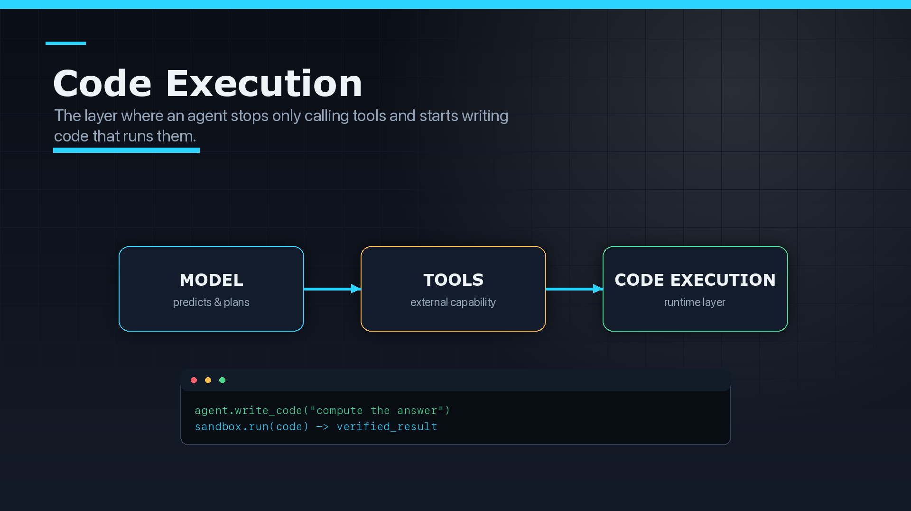
- Image: `CodeExeImages/scene-01-runtime-layer.png`
- Why this is a scene: Opening thesis: code execution is introduced as the runtime layer beneath agent behavior.
- Image prompt/spec: 16:9 technical infographic still, dark production background, readable labels, visual emphasis on code execution, crisp panels, runtime/system-diagram aesthetic.

## Scene 02: Live Execution Loop
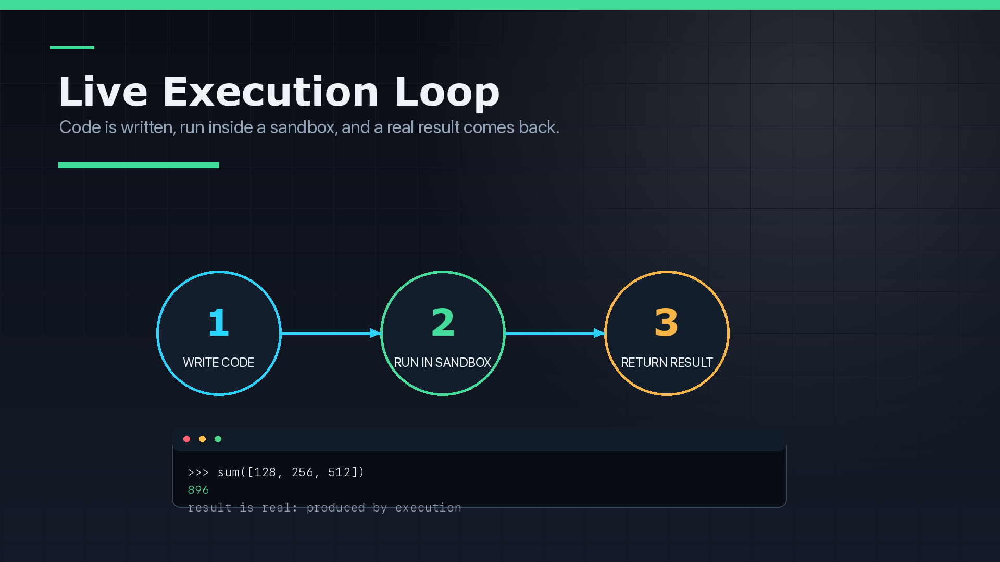
- Image: `CodeExeImages/scene-02-live-execution-loop.png`
- Why this is a scene: Live execution mechanics: code is written, sandboxed, executed, and returned as a real result.
- Image prompt/spec: 16:9 technical infographic still, dark production background, readable labels, visual emphasis on live execution loop, crisp panels, runtime/system-diagram aesthetic.

## Scene 03: Code Calls Tools
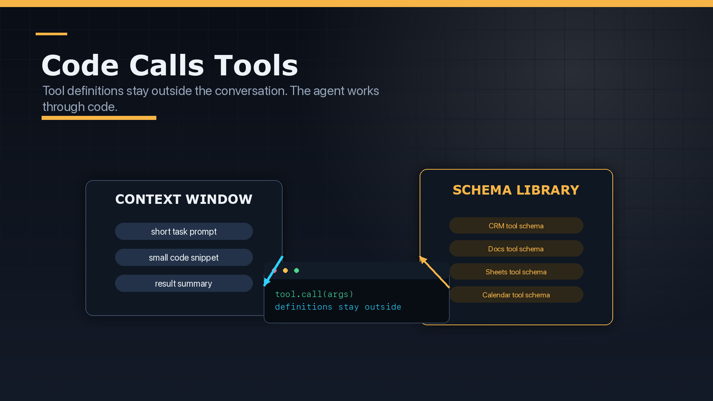
- Image: `CodeExeImages/scene-03-code-calls-tools.png`
- Why this is a scene: Core architectural move: the agent writes code that calls tools while schemas stay outside the context window.
- Image prompt/spec: 16:9 technical infographic still, dark production background, readable labels, visual emphasis on code calls tools, crisp panels, runtime/system-diagram aesthetic.

## Scene 04: Predicted vs Computed
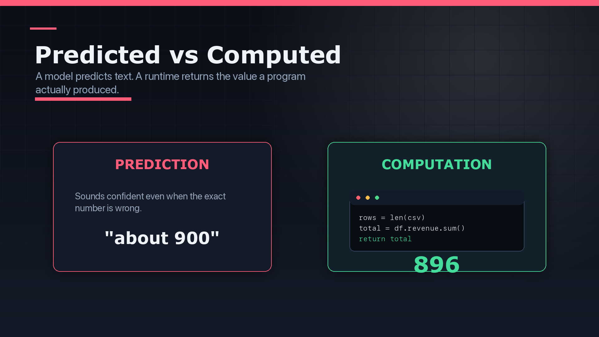
- Image: `CodeExeImages/scene-04-predicted-vs-computed.png`
- Why this is a scene: Conceptual contrast: predicted answers versus computed answers.
- Image prompt/spec: 16:9 technical infographic still, dark production background, readable labels, visual emphasis on predicted vs computed, crisp panels, runtime/system-diagram aesthetic.

## Scene 05: Documented Pattern
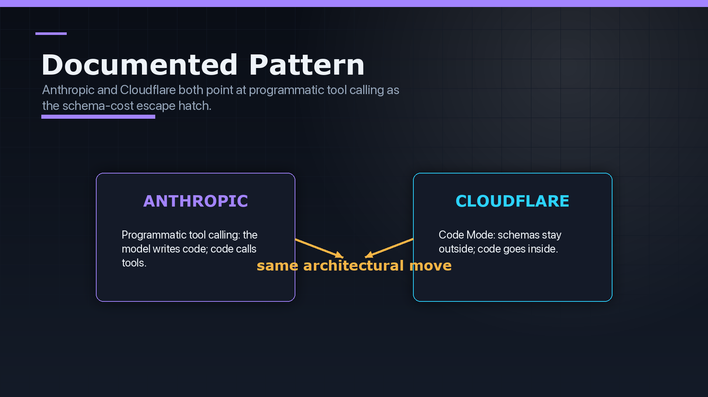
- Image: `CodeExeImages/scene-05-pattern-proof.png`
- Why this is a scene: External evidence beat: Anthropic and Cloudflare are used to establish this as a documented industry pattern.
- Image prompt/spec: 16:9 technical infographic still, dark production background, readable labels, visual emphasis on documented pattern, crisp panels, runtime/system-diagram aesthetic.

## Scene 06: Inside the Sandbox
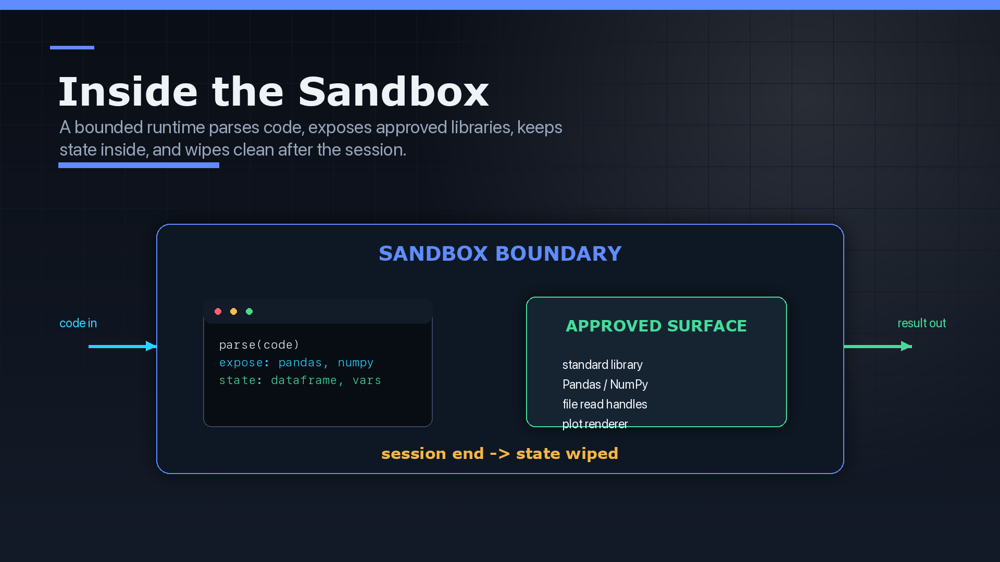
- Image: `CodeExeImages/scene-06-sandbox-internals.png`
- Why this is a scene: Runtime internals: the sandbox boundary, approved libraries, internal state, result egress, and cleanup.
- Image prompt/spec: 16:9 technical infographic still, dark production background, readable labels, visual emphasis on inside the sandbox, crisp panels, runtime/system-diagram aesthetic.

## Scene 07: Token Economics
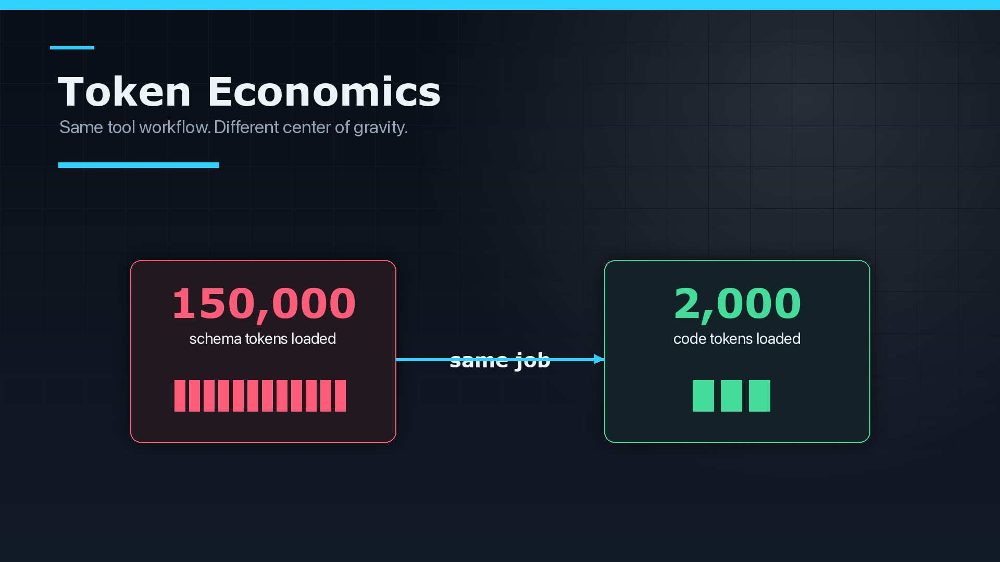
- Image: `CodeExeImages/scene-07-token-economics.png`
- Why this is a scene: Economic argument: schema-heavy prompting versus compact code execution.
- Image prompt/spec: 16:9 technical infographic still, dark production background, readable labels, visual emphasis on token economics, crisp panels, runtime/system-diagram aesthetic.

## Scene 08: Costs and Risks
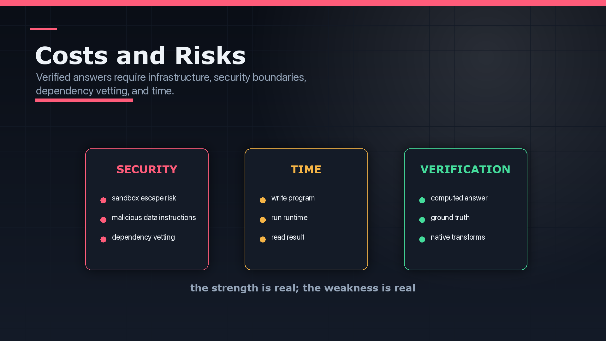
- Image: `CodeExeImages/scene-08-costs-and-risks.png`
- Why this is a scene: Tradeoff beat: security, time, and verification costs are made explicit.
- Image prompt/spec: 16:9 technical infographic still, dark production background, readable labels, visual emphasis on costs and risks, crisp panels, runtime/system-diagram aesthetic.

## Scene 09: Sales File Workflow
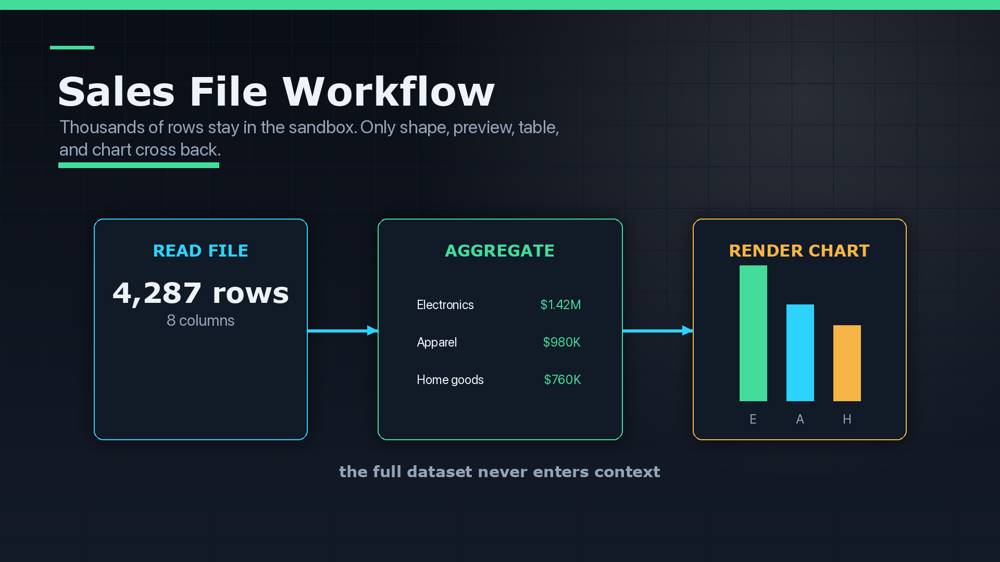
- Image: `CodeExeImages/scene-09-sales-file-workflow.png`
- Why this is a scene: Practical example: a sales file is loaded, aggregated, and charted without sending the full dataset into context.
- Image prompt/spec: 16:9 technical infographic still, dark production background, readable labels, visual emphasis on sales file workflow, crisp panels, runtime/system-diagram aesthetic.

## Scene 10: When To Reach For It
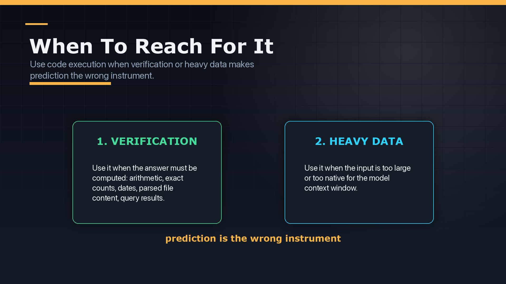
- Image: `CodeExeImages/scene-10-when-to-use.png`
- Why this is a scene: Decision framework: reach for code execution when verification or heavy data is load-bearing.
- Image prompt/spec: 16:9 technical infographic still, dark production background, readable labels, visual emphasis on when to reach for it, crisp panels, runtime/system-diagram aesthetic.

## Scene 11: Stop Predicting. Start Computing.
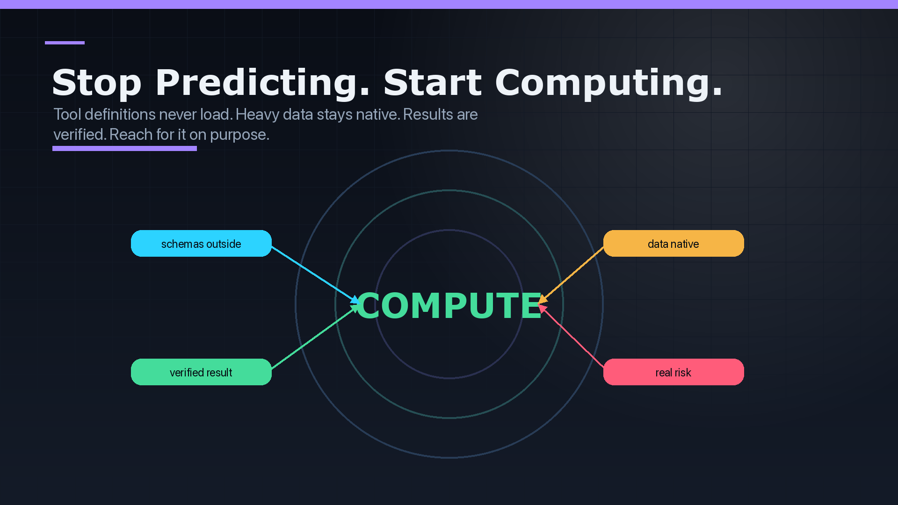
- Image: `CodeExeImages/scene-11-final-takeaway.png`
- Why this is a scene: Final synthesis: code execution means computing, native data handling, verified results, and real operational risk.
- Image prompt/spec: 16:9 technical infographic still, dark production background, readable labels, visual emphasis on stop predicting. start computing., crisp panels, runtime/system-diagram aesthetic.

## Scene 12: Code Execution Is The Runtime Layer
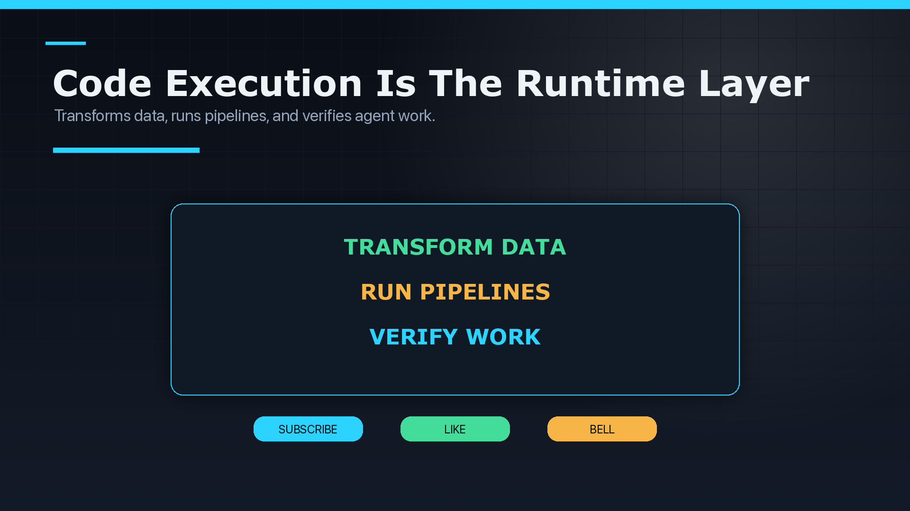
- Image: `CodeExeImages/scene-12-channel-cta.png`
- Why this is a scene: Channel CTA: the final audience action beat after the technical explanation concludes.
- Image prompt/spec: 16:9 technical infographic still, dark production background, readable labels, visual emphasis on code execution is the runtime layer, crisp panels, runtime/system-diagram aesthetic.
